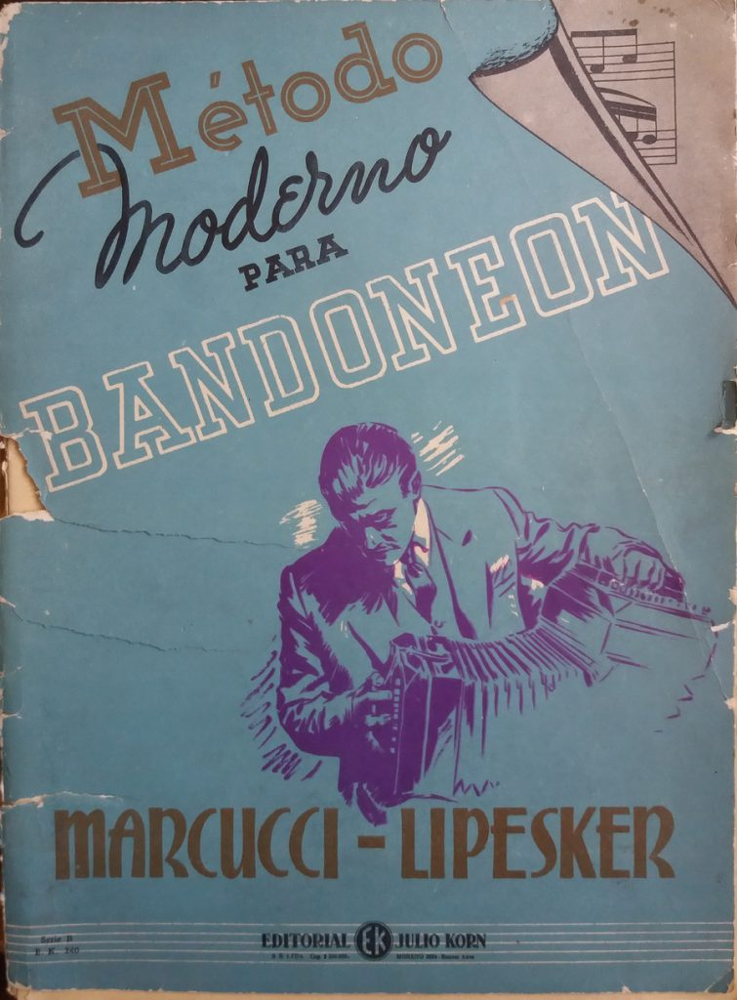

# Metodo Moderno para Bandoneon Updated Sheet Music

This project is to transcribe the sheet music in "Metodo Moderno para Bandoneon" by Carlos Marcucci Y Felix Lipesker using sheet music software.

## Reason for the Project
"Metodo Moderno para Bandoneon" out of print and the only copies online are very badly scanned. However, the way Carlos Marcucci Y Felix Lipesker teaches bandoneon should be preserved and celebrated.

However, because of the bad scan, the sheet music is often times difficult to read. This is a project to transcribe the sheet music using modern methods and then have the files available for ease of eletronic viewing on a tablet printed out on paper.

## Project Tools
Using Music Score (https://musescore.org/)
